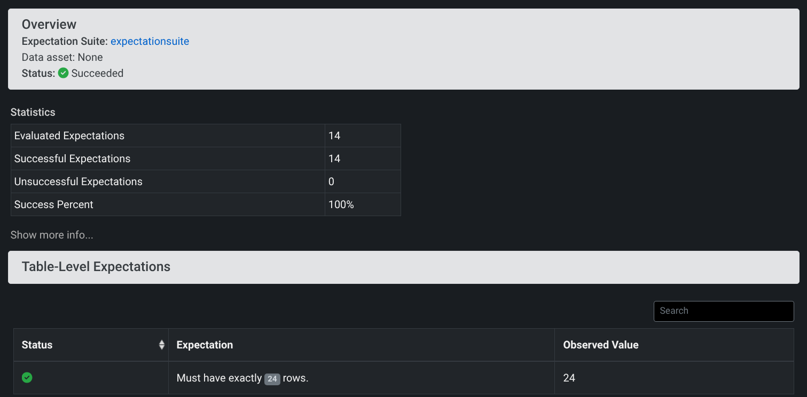
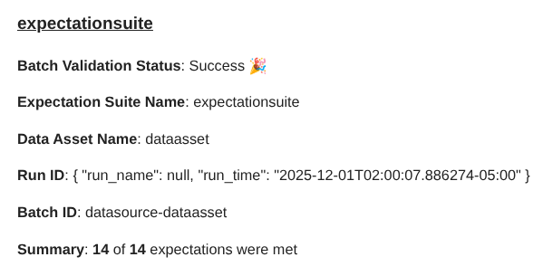
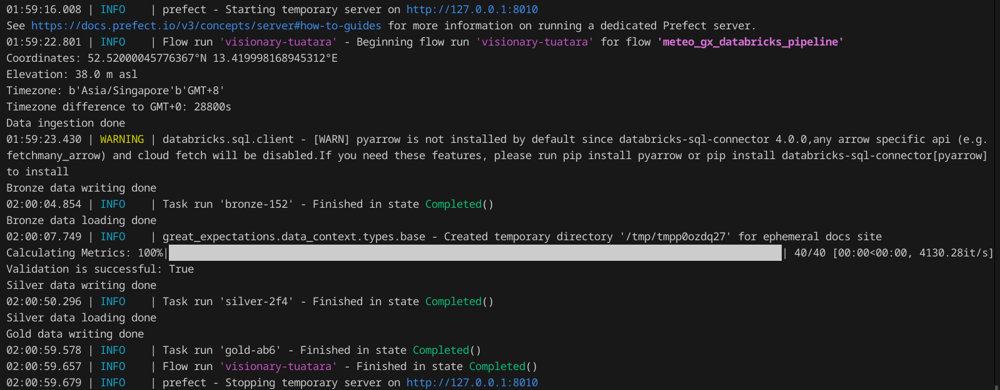
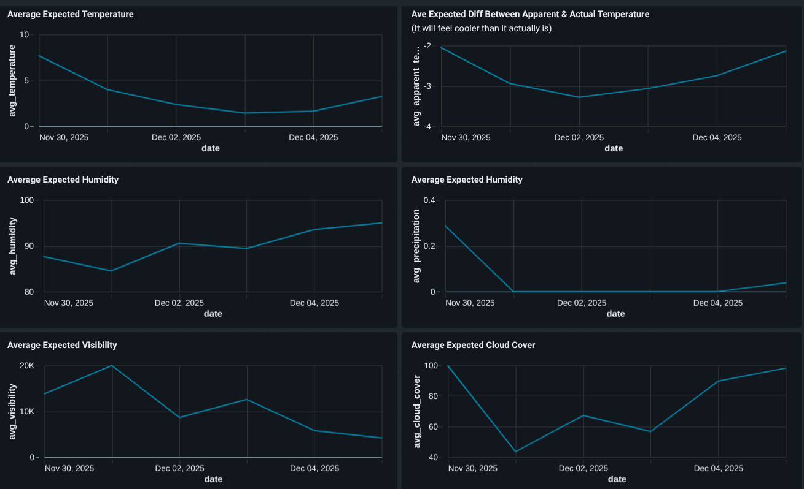

# Project Details

**Tools/Languages used:** *Python (pandas, great expectations, prefect, open-meteo API), databricks, SQL*

This project is intended to mirror an end-to-end data engineering pipeline, using a medallion architecture in databricks. In short, what it does includes:
- Getting forecasted weather data from open-meteo API
- Writing the data to a bronze table
- Validating the data using great expectations
- Writing the validated data to a silver table
- Aggregating the data 
- Writing the aggregated data to a gold table
- Building a dashboard using the aggregated data

To make the validation results more readable, the great expectation checkpoint has been configured to automatically update the data docs after each run (located in `/uncommited/data_docs/local_site/`). An easy way to view this if you use VS Code is using the `Live Server` extension.



Other than that, an email will also be sent with the validation results:



The entire pipeline is orchestrated using the [prefect](https://www.prefect.io/) library. 



The final output is a dashboard on databricks:



# Setup
Note: Make sure python version matches the current great expectations [requirements](https://pypi.org/project/great-expectations/).


```bash
uv python install 3.13

uv init project_name

cd project_name

uv python pin 3.13

uv add yfinance pandas great_expectations prefect databricks-sql-connector python-dotenv

uv pip install -e .

source .venv/bin/activate

```

## Configure Secrets
Create a new file `config/.env` with the secrets below:
```
RECEIVER_EMAIL=”the email you want to send a notification to”

SENDER_EMAIL=”the email you want to send from”

SENDER_EMAIL_APP_PASSWORD=”the password if needed, e.g., app password for gmail”

SERVER_HOSTNAME="databricks server hostname"

HTTP_PATH="databricks http path"

ACCESS_TOKEN="databricks access token"
```
The exact location of the `.env` file can be configured using the `DOTENV_PATH` variable in `/config/settings.py`.

## Databricks Setup

The last three are from databricks. Sign up for databricks free edition, then generate a personal access token by going to:

- Profile → Settings→ Developer → Generate new token

Get the server hostname and http path by going to:

- SQL warehouses → Severless Starter Warehouse → Connection details

Next, go to the SQL editor and setup the database:

```sql
CREATE DATABASE IF NOT EXISTS meteo_db;
USE meteo_db;
```

## Run Code
To run the entire pipeline:
```
python -m main
```
If instead of following a medallion architecture, you want to instead skip writing and loading from the bronze and silver tables, then run this:
```
python -m main --local-csv
```
In this case, a local data file in `/data` will be created. The details of this file can be configured in `/config/settings.py`.

If you want to run a specific file in `/src` instead:
```
python -m src.[file name without the '.py']
```
For example, if you want to test just `ingest_bronze.py`, then run:
```
python -m src.ingest_bronze
```

## Databricks Dashboard
Since this project uses a medallion data architecture, the gold level table already has aggregated table ready to be visualized in a dashboard. Go to Dashboards -> Create dashboard -> Data tab -> Create from SQL 
```SQL
select * from weather_summary_gold;
```
This creates a dataset. Now go to the dashboard tab and add visualizations based on this dataset.